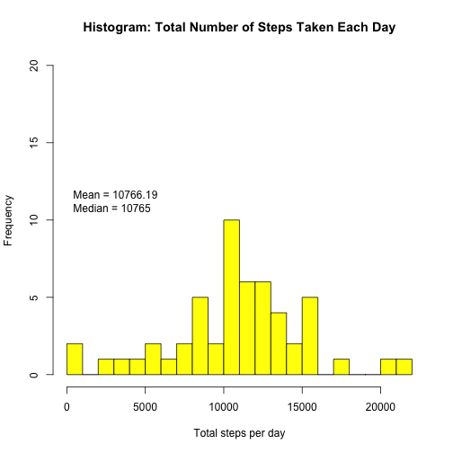
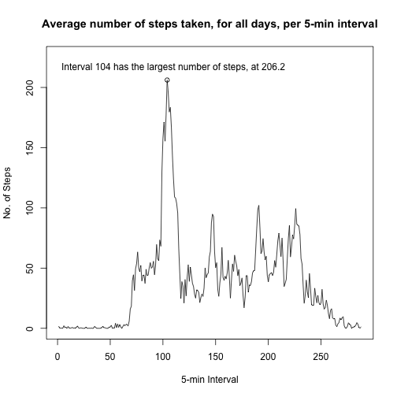
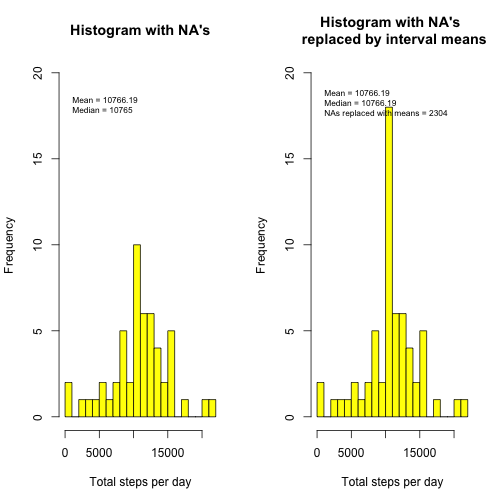
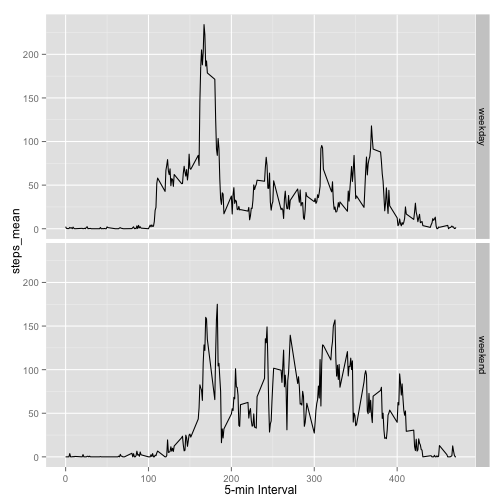

---
# Title: "Assignment1 - Reproducible Data"
author: "MVS"
date: "June 13, 2015"
output: html_document  
===========================================

## What is the mean total number of steps taken per day.


```r
library(plyr)
library(zoo)
library(timeDate)
library(chron)
library(ggplot2)
library(knitr)

# import the data csv
activity<-read.csv("activity.csv",header=TRUE,sep=",")

# use ddply to summarise the total steps per day
actsums <- ddply(activity, "date", summarise, steps_total = sum(steps))

# plot the histogram
hist(actsums$steps_total, ylim = c(0,20), col="yellow",xlab="Total steps per day", main = "Histogram: Total Number of Steps Taken Each Day", breaks=16)

# get mean and median values
tsteps_mean<-round(mean(actsums$steps_total, na.rm=TRUE),2)
tsteps_median<-round(median(actsums$steps_total, na.rm=TRUE),2)

# add stats to the plot
text(0, 11, paste("Mean =", tsteps_mean, "\nMedian =",tsteps_median), pos = 4)        
```

 

## What is the average daily activity pattern?


```r
# use ddply to summarise the avg steps per interval, across all days
actmean <- ddply(activity, "interval", summarise, steps_mean = mean(steps, na.rm=TRUE))

# plot the timeseries
plot(actmean$steps_mean, type="l", ylim=c(0,225), xlab="5-min Interval", ylab="No. of Steps", main="Average number of steps taken, for all days, per 5-min interval")
# place a circle on the plot at the location of the max value
maxloc <- which.max(actmean$steps_mean)
points(maxloc, max(actmean$steps_mean))

# add stats to the plot
text(110, 210, paste("Interval", maxloc, "has the largest number of steps, at", round(max(actmean$steps_mean),1)), pos = 3)        
```

 

## Inputting missing values


```r
# Get the total number of NA's in the DF
totalNA<- sum(is.na(activity$steps)) # or use summary(activity)
```

The total number of missing values in the dataset is 2304 


```r
# new data with missing values filled in by interval group means
activity_new<-transform(activity, steps = na.aggregate(steps, by = interval))

# use ddply to summarise the total steps per day
actnew_sums <- ddply(activity_new, "date", summarise, steps_total = sum(steps))

# get mean and median values - this will plot on histograms
tstepsnew_mean<-round(mean(actnew_sums$steps_total, na.rm=TRUE),2)
tstepsnew_median<-round(median(actnew_sums$steps_total, na.rm=TRUE),2)

# plot the histogram of the new dataset
par(mfrow=c(1,2))

hist(actsums$steps_total, ylim = c(0,20), col="yellow", xlab="Total steps per day", main = "Histogram with NA's", breaks=16)
# add stats to the plot
text(0, 18, paste("Mean =", tsteps_mean, "\nMedian =",tsteps_median), cex=0.7,pos = 4)        

hist(actnew_sums$steps_total, ylim = c(0,20), col="yellow",xlab="Total steps per day", main = "Histogram with NA's \n replaced by interval means", breaks=16)
# add stats to the plot
text(0, 18, paste("Mean =", tstepsnew_mean, "\nMedian =",tstepsnew_median, "\nNAs replaced with means =",totalNA), cex=0.7, pos = 4)        
```

 

By replacing the missing NA values, the means remain the same but the median increased slightly. The median marks the value below which 50% of the data are contained. Effectively, the new histogram shows a higher frequency of values in the center of the distribution. Note: 0's in the dataset were left unchanged but these could also be replaced with the mean.

## Activity differences between *weekdays* and *weekends*

```r
# indicate whether a day is a weekend day or a weekday
activity["DayType"]<-NA
activity$DayType = is.weekend(activity$date)
activity$DayType<-ifelse(activity$DayType,"weekend","weekday")
activity$DayType<-as.factor(activity$DayType)

# make a panel plot showing weekend vs weekday no. of steps
# use ddply to summarise the avg steps per interval, across day types
actmean <- ddply(activity, c("interval","DayType"), summarise, steps_mean = mean(steps, na.rm=TRUE))

# plot facets for weekend and weekday no. of steps
qplot(interval/5, steps_mean, data=actmean, geom='line', facets=DayType~., xlab="5-min Interval")
```

 

```r
# might be possible to incorporate the previous step into here.
```
